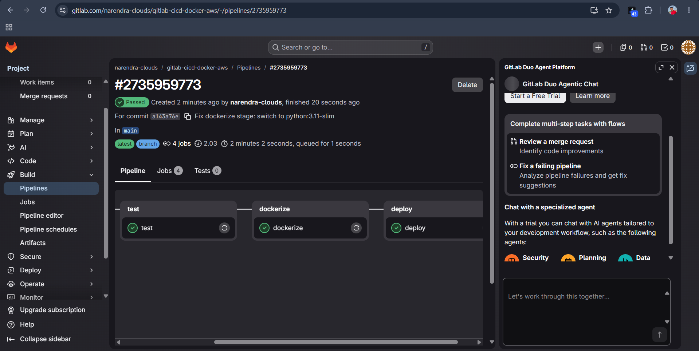
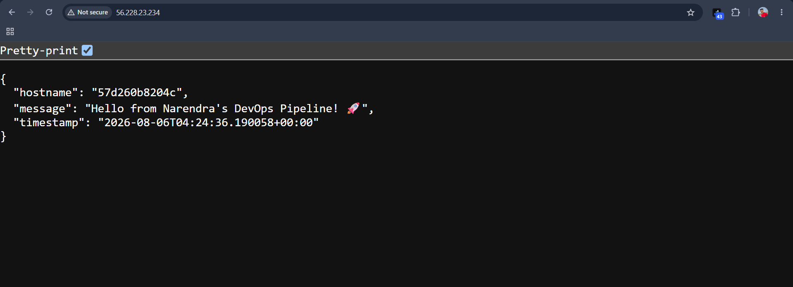
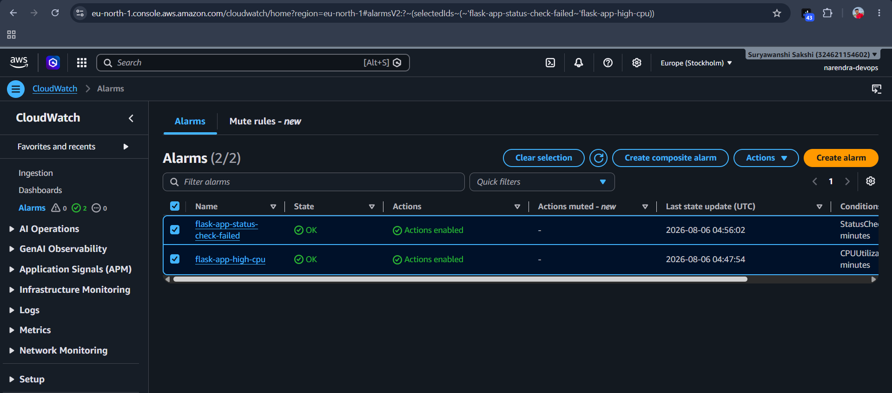
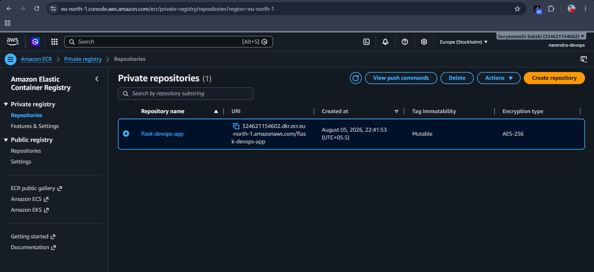

# GitLab CI/CD Pipeline – Automated Docker Deployment to AWS EC2

An end-to-end, fully automated CI/CD pipeline that builds, tests, containerizes, and deploys a Flask web application to an AWS EC2 instance — triggered automatically on every push to `main`. Docker images are stored in AWS ECR, and infrastructure health is monitored via CloudWatch alarms with SNS email alerts.



**Live demo:** `http://<your-ec2-public-ip>`



---

## Table of Contents

- [Why Two Git Platforms?](#why-two-git-platforms)
- [Architecture](#architecture)
- [Tech Stack](#tech-stack)
- [Project Structure](#project-structure)
- [Prerequisites](#prerequisites)
- [Setup Guide](#setup-guide)
  - [1. Get the Code onto GitHub + GitLab](#1-get-the-code-onto-github--gitlab)
  - [2. Create the ECR Repository](#2-create-the-ecr-repository)
  - [3. Launch the EC2 Instance](#3-launch-the-ec2-instance)
  - [4. Create an IAM User for GitLab](#4-create-an-iam-user-for-gitlab)
  - [5. Add GitLab CI/CD Variables](#5-add-gitlab-cicd-variables)
  - [6. Trigger the Pipeline](#6-trigger-the-pipeline)
  - [7. Set Up CloudWatch + SNS Alarms](#7-set-up-cloudwatch--sns-alarms)
- [Pipeline Stages Explained](#pipeline-stages-explained)
- [Troubleshooting Log (Real Issues Faced)](#troubleshooting-log-real-issues-faced)
- [Local Development](#local-development)
- [Author](#author)

---

## Why Two Git Platforms?

This project intentionally lives on **both GitHub and GitLab**, and that's not duplication — they serve different purposes:

| Platform | Purpose |
|---|---|
| **GitHub** | Public portfolio — where recruiters, interviewers, and this README are meant to be viewed |
| **GitLab** | Where the actual `.gitlab-ci.yml` pipeline executes — GitLab CI/CD only runs on GitLab, not GitHub |

GitHub has its own equivalent (GitHub Actions, using `.github/workflows/*.yml`), but this project specifically demonstrates **GitLab CI/CD**, so GitLab is required to run the pipeline. Same code, pushed to two remotes.

---

## Architecture

```
Developer pushes to `main`
        │
        ▼
   GitLab CI/CD Pipeline
        │
        ├── build     → install Python dependencies
        ├── test      → run pytest unit tests
        ├── dockerize → build Docker image, push to AWS ECR
        └── deploy    → SSH into EC2, pull latest image, restart container
                              │
                              ▼
                     Flask app running on EC2
                     (monitored by CloudWatch + SNS)
```

- **Flask app** runs inside a Docker container on a single EC2 instance, exposed on port 80.
- **AWS ECR** stores every image, tagged both `latest` and with the Git commit SHA (so any past build can be redeployed).
- **CloudWatch alarms** watch CPU usage and instance health checks; **SNS** emails you when something's wrong.

---

## Tech Stack

- **App**: Python 3.11, Flask
- **Testing**: pytest
- **CI/CD**: GitLab CI/CD (`.gitlab-ci.yml`)
- **Containerization**: Docker
- **Container Registry**: AWS ECR
- **Compute**: AWS EC2 (Ubuntu 22.04)
- **Monitoring**: AWS CloudWatch (CPU + status-check alarms) + SNS (email alerts)
- **Secrets Management**: GitLab CI/CD Variables (masked/protected)

---

## Project Structure

```
gitlab-cicd-docker-aws/
├── app.py              # Flask application
├── test_app.py         # pytest unit tests
├── requirements.txt    # Python dependencies
├── Dockerfile           # Container build instructions
├── .gitlab-ci.yml      # Pipeline definition (build/test/dockerize/deploy)
├── .gitignore
└── README.md
```

---

## Prerequisites

- An AWS account (free tier is enough)
- A GitHub account and a GitLab account
- Git and a code editor (VS Code recommended) installed locally
- Basic comfort with the terminal

---

## Setup Guide

### 1. Get the Code onto GitHub + GitLab

Create two empty repositories with the same name — one on [github.com/new](https://github.com/new), one on [gitlab.com/projects/new](https://gitlab.com/projects/new) — both **public**, neither initialized with a README (since this repo already has one).

From your local project folder:

```bash
git init
git add .
git commit -m "Initial commit"
git branch -M main

# GitHub remote
git remote add origin https://github.com/<your-username>/gitlab-cicd-docker-aws.git
git push -u origin main

# GitLab remote (added as a second remote, not "origin")
git remote add gitlab https://gitlab.com/<your-username>/gitlab-cicd-docker-aws.git
git push -u gitlab main
```

> **Note:** `.gitlab-ci.yml` is a dotfile — some file pickers hide it or fail to save it properly. If you hit this, create it directly inside your code editor (`File → New File`, save as `.gitlab-ci.yml` exactly) rather than downloading it.

### 2. Create the ECR Repository

1. AWS Console → **ECR** → **Create repository**
2. Name: `flask-devops-app`
3. Leave settings default → **Create repository**
4. Copy the repository URI, e.g. `123456789012.dkr.ecr.eu-north-1.amazonaws.com/flask-devops-app`

### 3. Launch the EC2 Instance

1. AWS Console → **EC2** → **Launch instance**
2. Name: `flask-devops-app-server`
3. AMI: **Ubuntu Server 22.04 LTS**
4. Instance type: `t2.micro` (free tier)
5. Key pair: create a new one (download the `.pem` file and keep it safe — you can't re-download it later)
6. Network settings: allow **SSH** (from My IP) and **HTTP** (port 80, from anywhere)
7. Launch, then copy the instance's **Public IPv4 address**

SSH in and install Docker + AWS CLI:

```bash
chmod 400 your-key.pem
ssh -i your-key.pem ubuntu@<EC2_PUBLIC_IP>

sudo apt update
sudo apt install -y docker.io unzip
sudo usermod -aG docker ubuntu
sudo systemctl enable docker
sudo systemctl start docker

# Install AWS CLI
curl "https://awscli.amazonaws.com/awscli-exe-linux-x86_64.zip" -o "awscliv2.zip"
unzip awscliv2.zip
sudo ./aws/install
aws configure   # enter IAM user's access key, secret key, region, output format (see Step 4 below)

exit
ssh -i your-key.pem ubuntu@<EC2_PUBLIC_IP>   # reconnect so docker group applies
docker ps                                      # should run with no errors
```

> If your instance is ever **terminated and recreated**, you'll get a new public IP — repeat this Docker + AWS CLI setup on the new instance, and update `EC2_HOST` in GitLab (Step 5) with the new IP.

### 4. Create an IAM User for GitLab

1. AWS Console → **IAM** → **Users** → **Create user**
2. Name: `gitlab-cicd-user` — do **not** enable console access
3. Attach policy: `AmazonEC2ContainerRegistryFullAccess`
4. Create the user → open it → **Security credentials** tab → **Create access key** → choose **Command Line Interface (CLI)**
5. Save the **Access Key ID** and **Secret Access Key** immediately — the secret is shown only once

### 5. Add GitLab CI/CD Variables

In your GitLab project: **Settings → CI/CD → Variables → Add variable**

| Key | Value | Mask? |
|---|---|---|
| `AWS_ACCOUNT_ID` | Your 12-digit AWS account ID | No |
| `AWS_REGION` | e.g. `eu-north-1` | No |
| `ECR_REPOSITORY_NAME` | `flask-devops-app` | No |
| `AWS_ACCESS_KEY_ID` | IAM user's access key | Yes |
| `AWS_SECRET_ACCESS_KEY` | IAM user's secret key | Yes |
| `EC2_HOST` | EC2 public IP | No |
| `EC2_USER` | `ubuntu` | No *(too short to mask)* |
| `EC2_SSH_PRIVATE_KEY` | Full contents of your `.pem` file | No *(multi-line values can't be masked)* |

Also confirm `main` is a **protected branch** (Settings → Repository → Protected branches), since all variables above are marked "Protected."

### 6. Trigger the Pipeline

Push any change to `main`, or go to **Build → Pipelines → New pipeline** and run it manually against `main`. Watch the four stages run: `build → test → dockerize → deploy`.

Once `deploy` succeeds, visit `http://<EC2_PUBLIC_IP>` — you should see the Flask app's JSON response.

### 7. Set Up CloudWatch + SNS Alarms

**Create the SNS topic:**
1. AWS Console → **SNS** → **Topics** → **Create topic** (Standard) → name it `flask-app-alerts`
2. **Create subscription** → Protocol: Email → enter your email
3. Confirm the subscription via the email AWS sends you

**Create a CPU alarm:**
1. **CloudWatch → Alarms → Create alarm → Select metric → EC2 → Per-Instance Metrics**
2. Search and select `CPUUtilization` for your instance
3. Statistic: Average, Period: 5 minutes, Threshold: Greater than `80`
4. Notification: select the `flask-app-alerts` SNS topic
5. Name it `flask-app-high-cpu` → Create

**Create a status-check (health) alarm:**
1. Same flow, but select the `StatusCheckFailed` metric
2. Statistic: Maximum, Period: 5 minutes, Threshold: Greater than `0`
3. Notification: same SNS topic
4. Name it `flask-app-status-check-failed` → Create



---

## Pipeline Stages Explained

| Stage | What it does |
|---|---|
| `build` | Installs Python dependencies (`requirements.txt`) |
| `test` | Runs `pytest test_app.py` against the Flask app |
| `dockerize` | Builds the Docker image and pushes it to AWS ECR, tagged with both the Git commit SHA and `latest` |
| `deploy` | SSHes into the EC2 instance, pulls the newly pushed image from ECR, stops/removes the old container, and starts the new one on port 80 |



---

## Troubleshooting Log (Real Issues Faced)

Documenting these because they're common gotchas, not just theory:

1. **"yaml invalid" + 0 jobs on the pipeline page** → Usually not a YAML syntax error at all. Hover the badge — if it says *"Identity verification is required in order to run CI jobs,"* it's GitLab's free-tier anti-abuse check. Fix: click **"Verify my account"** on the Pipelines page (phone/card verification, no charge).

2. **`dockerize` fails with `Error relocating ... pyexpat ... symbol not found`** → A known Alpine Linux 3.20 bug where `aws-cli` (or even `python3` itself) installed via `apk` breaks due to a `musl` libc incompatibility. Installing `awscli` via `pip` on top of Alpine hits the *same* underlying bug. **Fix:** don't use an Alpine-based image for this job at all — switch to `image: python:3.11-slim` (Debian-based) for the `dockerize` stage.

3. **`docker: command not found` after switching to `python:3.11-slim`** → The Debian `docker.io` apt package doesn't reliably put the `docker` binary on PATH in this image. **Fix:** download the official static Docker CLI binary directly from `download.docker.com` instead of relying on `apt`.

4. **`git push` says "Everything up to date" when you expect a new commit** → Almost always means the file was edited in the editor but **never actually saved** (check for an unsaved-changes dot on the file tab) before running `git add`. Save first, then re-check with `git status`.

5. **GitLab variable creation fails: "The value must have 8 characters" when masking** → GitLab requires masked values to be at least 8 characters. Short values like `ubuntu` (for `EC2_USER`) simply can't be masked — uncheck "Mask variable" for those; masking is only needed for actual secrets like access keys.

6. **EC2 instance terminated and recreated** → You get a brand-new public IP. Remember to: reinstall Docker + AWS CLI on the new instance, and update the `EC2_HOST` variable in GitLab to the new IP before the next pipeline run.

---

## Local Development

```bash
pip install -r requirements.txt
python app.py
# visit http://localhost:5000
```

### Run with Docker

```bash
docker build -t flask-devops-app .
docker run -p 5000:5000 flask-devops-app
```

### Run Tests

```bash
pytest test_app.py -v
```

---

## Author

**Narendra Deshmukh**
[LinkedIn](https://linkedin.com/in/narendra-deshmukh-cloud) · [GitHub](https://github.com/narendra-clouds)

Built as a hands-on, self-taught DevOps project — every error above was hit and debugged live while building this, not copy-pasted from a tutorial.